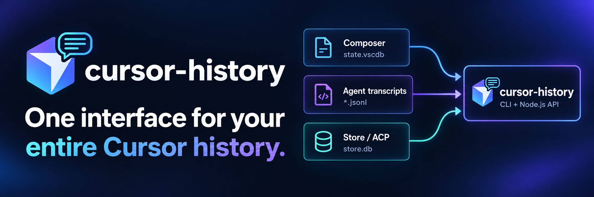

# Cursor History

<p align="center">
  
</p>

[](https://www.npmjs.com/package/cursor-history)
[](https://www.npmjs.com/package/cursor-history)
[](https://opensource.org/licenses/MIT)
[](https://nodejs.org/)
[](https://www.typescriptlang.org/)

🇺🇸 [English](../README.md) | 🇨🇳 [中文](./readme_zh.md) | 🇫🇷 [Français](./readme_fr.md) | 🇪🇸 [Español](./readme_es.md) | 🇯🇵 [日本語](./readme_ja.md) | 🇰🇷 [한국어](./readme_ko.md) | 🇺🇦 [Українська](./readme_uk.md)

**Una interfaz para todo tu historial de Cursor.**

Las conversaciones de Cursor pueden estar repartidas entre espacios de trabajo, bases de datos del IDE, transcripciones de Agent y almacenes de sesiones CLI / ACP más recientes. `cursor-history` descubre las fuentes locales compatibles y permite acceder a ellas mediante un CLI y una biblioteca de Node.js.

Busca en el contenido de las conversaciones de varios espacios de trabajo, consulta los mensajes y la actividad de herramientas disponible, y exporta a Markdown o JSON. Respalda y restaura el historial de Composer, o migra las sesiones de Composer compatibles cuando tus proyectos cambien de ubicación.

**¿Ya tienes meses de historial de Cursor? No necesitas capturarlo previamente ni configurar un índice.** La búsqueda se ejecuta en local, sin embeddings ni clave de API.

**¿Prefieres una interfaz de servidor MCP?** Conecta [cursor-history-mcp](https://github.com/S2thend/cursor-history-mcp#quick-start) para exponer el historial como herramientas MCP. Los agentes también pueden invocar directamente la CLI o la API de Node.js de este proyecto: elige la interfaz que encaje con tu flujo de trabajo. Los paquetes se publican por separado; consulta la [compatibilidad y las notas de publicación de MCP](https://github.com/S2thend/cursor-history-mcp#compatibility).

## Inicio rápido

```bash
npm install -g cursor-history

cursor-history list --all
cursor-history search "authentication"
cursor-history show 1
cursor-history export 1
cursor-history backup
```

Requiere Node.js 20.x o 22.x–26.x y un historial local de Cursor existente. Para probarlo sin una instalación permanente: `npx cursor-history list --all`.

Los números de `show` y `export` corresponden a la lista de la misma fuente de datos y el mismo ámbito de espacio de trabajo; usa el UUID de la sesión en los comandos que guardes. `backup` archiva las bases de Composer, no las de Store ni las transcripciones.

[Instalación](#instalación) · [Uso](#uso) · [Ejemplos de salida](../README.md#example-output) · [API de biblioteca](#api-de-biblioteca) · [Hoja de ruta](#hoja-de-ruta) · [Compatibilidad](#compatibilidad-y-actualizaciones)

## Por qué existe esta herramienta

Quizá recuerdes haber resuelto un problema con Cursor, pero no en qué proyecto, sesión o interfaz. Una búsqueda por palabra clave en el historial local puede ayudarte a recuperar esa conversación.

El [CLI de Agent de Cursor](https://cursor.com/docs/cli/reference/parameters) ofrece `agent ls`, `agent resume` y `agent --resume=<id>` para encontrar o retomar sesiones del CLI. `cursor-history` añade flujos para leer y gestionar el historial local compatible entre espacios de trabajo y formatos de almacenamiento.

| Qué quieres hacer | Por dónde empezar |
|---|---|
| Retomar una conversación en Cursor Agent CLI | `agent ls` o `agent --resume=<id>` de Cursor |
| Buscar una frase en conversaciones de varios espacios de trabajo | `cursor-history search "connection pool"` |
| Leer o exportar una sesión local descubierta | `cursor-history show 1` o `cursor-history export 1` |
| Respaldar o restaurar el historial de Composer | `cursor-history backup` / `cursor-history restore` ([uso](#respaldo-y-restauración)) |
| Mover sesiones de Composer compatibles a otro espacio de trabajo | `cursor-history migrate-session` ([uso](#migrar-sesiones)) |
| Usar el historial desde tu propia aplicación | [API de Node.js](#api-de-biblioteca) |

## Varias generaciones de almacenamiento e interfaces de Cursor

Distintas versiones e interfaces de Cursor pueden dejar diferentes representaciones locales en la misma máquina. `cursor-history` descubre estas fuentes compatibles:

| Fuente | Archivos locales | Uso |
|---|---|---|
| Formato antiguo / Composer | `workspaceStorage/*/state.vscdb` y `globalStorage/state.vscdb` en el directorio de usuario de Cursor | Registros de espacios de trabajo y datos globales de conversaciones |
| Transcripciones de Agent | `~/.cursor/projects/**/agent-transcripts/**/*.jsonl` | Texto de conversaciones y llamadas de herramientas presentes en la transcripción |
| Store / CLI | `~/.cursor/chats/**/store.db` | Datos de conversación de Store por sesión |
| Sesiones ACP | `~/.cursor/acp-sessions/**/store.db` | Datos de Store descubiertos bajo la raíz de ACP |

Consulta [Dónde almacena datos Cursor](#dónde-almacena-datos-cursor) para ver rutas por plataforma, raíces personalizadas y configuración de WSL.

Estas representaciones no siempre contienen los mismos campos. Una transcripción puede omitir marcas de tiempo o resultados de herramientas. Cuando coexisten una base de Store utilizable y una transcripción dentro del ámbito permitido, la base aporta la conversación de Store y la transcripción se conserva como procedencia. Los detalles de fuente y de procedencia temporal permiten distinguir datos almacenados, valores inferidos y vistas parciales.

Poder leer una fuente no implica poder respaldarla o migrarla: los archivos de respaldo actuales solo contienen Composer, y las sesiones Store-only o de fuentes combinadas no se pueden migrar. La ampliación está en la [hoja de ruta](#hoja-de-ruta). Consulta los límites completos en el [contrato de compatibilidad e integridad](./compatibility.md).

## Tres formas de usar tu historial

### Encontrarlo

```bash
cursor-history list --all
cursor-history search "connection pool"
cursor-history show 1
```

Encuentra la conversación en la que ya resolviste el problema, aunque pertenezca a otro espacio de trabajo. Puedes buscar en el historial local compatible creado antes de instalar esta herramienta.

### Conservarlo

```bash
cursor-history export 1
cursor-history backup
cursor-history migrate-session 1 /path/to/new/workspace --dry-run
```

Exporta las sesiones legibles a Markdown o JSON. Respalda el historial de Composer y previsualiza la migración de las sesiones de Composer compatibles antes de moverlas.

### Reutilizarlo

Usa directamente la [biblioteca de Node.js](#api-de-biblioteca), o conecta el servidor independiente [cursor-history-mcp](https://github.com/S2thend/cursor-history-mcp) para que un asistente compatible con MCP pueda buscar en tu historial de desarrollo.

Puede que ya tengas meses de decisiones, correcciones, prompts y actividad de herramientas en disco. Haz que ese contexto sea más fácil de encontrar la próxima vez que lo necesites.

## Características

- **Interfaz dual** - Úsalo como herramienta CLI o impórtalo como biblioteca en tus proyectos Node.js
- **Listar sesiones** - Ver todas las sesiones de chat en todos los espacios de trabajo
- **Consultar conversaciones** - Examinar el contenido disponible en cada fuente, incluyendo:
  - Respuestas de IA con explicaciones en lenguaje natural
  - **Visualización completa de diff** para ediciones de archivos con resaltado de sintaxis
  - **Llamadas de herramientas detalladas** mostrando todos los parámetros (rutas de archivos, patrones de búsqueda, comandos, etc.)
  - Razonamiento y pensamiento de la IA
  - Marcas de tiempo con procedencia explícita (almacenada o inferida)
- **Búsqueda** - Buscar por palabra clave en el contenido de conversaciones de varios espacios de trabajo, con coincidencias resaltadas
- **Exportar** - Guardar sesiones como archivos Markdown o JSON
- **Migrar** - Mover o copiar sesiones de Composer compatibles entre espacios de trabajo (ej. al renombrar proyectos)
- **Respaldo y restauración** - Respaldar las bases de Composer y restaurarlas cuando sea necesario
- **Multiplataforma** - Funciona en macOS, Windows y Linux

## Instalación

### Desde NPM (Recomendado)

```bash
# Instalar globalmente
npm install -g cursor-history

# Usar el CLI
cursor-history list
```

### Desde el código fuente

```bash
# Clonar y compilar
git clone https://github.com/S2thend/cursor_chat_history.git
cd cursor_chat_history
npm install
npm run build

# Ejecutar directamente
node dist/cli/index.js list

# O enlazar globalmente
npm link
cursor-history list
```

## Requisitos

- Node.js 20.x o 22.x–26.x (Node 21 no es compatible; se recomienda Node.js 22.5+ para SQLite integrado)
- Historial local existente de Cursor IDE o Agent CLI en un formato compatible

## Configuración del controlador SQLite

cursor-history soporta dos controladores SQLite para máxima compatibilidad:

| Controlador | Descripción | Límite de capacidad de Node.js |
|-------------|-------------|--------------------------------|
| `node:sqlite` | Módulo integrado; solo se elige si incluye todas las API requeridas | Lectura desde 22.5; respaldo en línea desde 22.16.0 y 23.8.0 |
| `better-sqlite3` | Binding nativo y alternativa automática cuando es capaz | Versiones principales 20 y 22–26 |

### Selección automática de controlador

cursor-history selecciona por operación y comprueba capacidades reales, no solo si el módulo se
puede importar:

1. prefiere **node:sqlite** cuando dispone de todas las API requeridas;
2. de lo contrario usa un **better-sqlite3** instalado y capaz.

Un controlador forzado nunca usa otro como respaldo: si no tiene una capacidad requerida, la
operación falla con un error tipado y una solución accionable.

### Selección manual de controlador

Puedes forzar un controlador específico usando la variable de entorno:

```bash
# Forzar better-sqlite3
CURSOR_HISTORY_SQLITE_DRIVER=better-sqlite3 cursor-history list

# Forzar node:sqlite (debe incluir todas las API requeridas por la operación)
CURSOR_HISTORY_SQLITE_DRIVER=node:sqlite cursor-history list
```

### Depurar selección de controlador

Para ver qué controlador se está usando:

```bash
DEBUG=cursor-history:* cursor-history list
```

### Control de controlador vía API de biblioteca

Al usar cursor-history como biblioteca, puedes controlar el controlador programáticamente:

```typescript
import { setDriver, getActiveDriver, listSessions } from 'cursor-history';

// Forzar un controlador específico antes de cualquier operación
setDriver('better-sqlite3');

// Verificar qué controlador está activo
const driver = getActiveDriver();
console.log(`Usando controlador: ${driver}`);

// O configurar vía LibraryConfig
const result = await listSessions({
  sqliteDriver: 'node:sqlite'  // Forzar node:sqlite para esta llamada
});
```

## Uso

### Listar sesiones

```bash
# Listar sesiones recientes (por defecto: 20)
cursor-history list

# Listar todas las sesiones
cursor-history list --all

# Listar con IDs de composer (para herramientas externas)
cursor-history list --ids

# Limitar resultados
cursor-history list -n 10

# Listar solo espacios de trabajo
cursor-history list --workspaces
```

### Ver una sesión

```bash
# Mostrar sesión por número de índice
cursor-history show 1

# Mostrar con mensajes truncados (vista rápida)
cursor-history show 1 --short

# Mostrar texto completo de pensamiento/razonamiento de IA
cursor-history show 1 --think

# Mostrar los detalles completos de las llamadas de herramientas (comandos, contenido, resultados)
cursor-history show 1 --tool

# Mostrar mensajes de error completos (sin truncar a 300 caracteres)
cursor-history show 1 --error

# Filtrar por tipo de mensaje (user, assistant, tool, thinking, error)
cursor-history show 1 --only user
cursor-history show 1 --only user,assistant
cursor-history show 1 --only tool,error

# Combinar opciones
cursor-history show 1 --short --think --tool --error
cursor-history show 1 --only user,assistant --short

# Salida como JSON
cursor-history show 1 --json
```

### Buscar

```bash
# Buscar palabra clave
cursor-history search "react hooks"

# Limitar resultados
cursor-history search "api" -n 5

# Ajustar contexto alrededor de coincidencias
cursor-history search "error" --context 100
```

### Exportar

```bash
# Exportar una sesión a Markdown
cursor-history export 1

# Exportar a archivo específico
cursor-history export 1 -o ./mi-chat.md

# Exportar como JSON
cursor-history export 1 --format json

# Exportar todas las sesiones a un directorio
cursor-history export --all -o ./exports/

# Sobrescribir archivos existentes
cursor-history export 1 --force
```

### Migrar sesiones

La migración admite las sesiones de Composer que cumplan los requisitos. Se rechazan las sesiones Store-only, de fuentes combinadas o ambiguas; usa `--dry-run` para previsualizar una migración.

```bash
# Mover una sesión a otro espacio de trabajo
cursor-history migrate-session 1 /ruta/a/nuevo/proyecto

# Mover múltiples sesiones (índices o IDs separados por comas)
cursor-history migrate-session 1,3,5 /ruta/a/proyecto

# Copiar en lugar de mover (mantiene el original)
cursor-history migrate-session --copy 1 /ruta/a/proyecto

# Previsualizar qué pasaría sin hacer cambios
cursor-history migrate-session --dry-run 1 /ruta/a/proyecto

# Mover todas las sesiones de un espacio de trabajo a otro
cursor-history migrate /proyecto/antiguo /proyecto/nuevo

# Copiar todas las sesiones (respaldo)
cursor-history migrate --copy /proyecto /respaldo/proyecto

# Forzar fusión con sesiones existentes en destino
cursor-history migrate --force /proyecto/antiguo /proyecto/existente
```

### Respaldo y restauración

Los archivos de respaldo contienen datos de Composer `state.vscdb`. No incluyen bases de Store, transcripciones de Agent ni almacenes de sesiones ACP. Exporta las sesiones legibles de esas fuentes a Markdown o JSON si necesitas una copia portable; esas exportaciones no son respaldos restaurables.

```bash
# Crear respaldo del historial de Composer
cursor-history backup

# Crear respaldo en archivo específico
cursor-history backup -o ~/mi-respaldo.zip

# Sobrescribir respaldo existente
cursor-history backup --force

# Listar respaldos disponibles
cursor-history list-backups

# Listar respaldos en directorio específico
cursor-history list-backups -d /ruta/a/respaldos

# Restaurar desde respaldo
cursor-history restore ~/cursor-history-backups/backup.zip

# Restaurar a ubicación personalizada
cursor-history restore backup.zip --target /cursor/data/personalizado

# Forzar sobrescritura de datos existentes
cursor-history restore backup.zip --force

# Ver sesiones de un respaldo sin restaurar
cursor-history list --backup ~/backup.zip
cursor-history show 1 --backup ~/backup.zip
cursor-history search "consulta" --backup ~/backup.zip
cursor-history export 1 --backup ~/backup.zip
```

### Opciones globales

```bash
# Salida como JSON (funciona con todos los comandos)
cursor-history --json list

# Usar ruta de datos de Cursor personalizada
cursor-history --data-path ~/.cursor-alt list

# Filtrar por espacio de trabajo
cursor-history --workspace /ruta/a/proyecto list
```

## Qué puedes ver

Al navegar tu historial de chat, verás:

- **Conversaciones completas** - Todos los mensajes intercambiados con Cursor AI
- **Cada mensaje se renderiza** - Cada mensaje resuelto se muestra una vez en orden; los duplicados consecutivos no se pliegan, por lo que las llamadas a herramientas, la procedencia y los datos de tokens distintos nunca se ocultan
- **Marcas de tiempo** - La hora almacenada directamente de un mensaje cuando está disponible (formato HH:MM:SS); los mensajes sin hora directa no muestran marca de tiempo en lugar de usar un respaldo fabricado
- **Sesiones resueltas entre pilas** - Cuando el mismo UUID existe en Composer y Store, cursor-history conserva las identidades Composer compatibles y resuelve una vista con procedencia explícita. El alcance del espacio de trabajo se aplica antes de leer contenido: una fuente conocida fuera del límite no se abre y hace que la vista sea parcial; las fuentes permitidas siguen la política canónica de backbone y enriquecimiento, no una unión ciega campo a campo.
- **Acciones de herramientas IA** - Vista detallada de lo que hizo Cursor AI:
  - **Ediciones/escrituras de archivos** - Visualización completa de diff con resaltado de sintaxis mostrando exactamente qué cambió
  - **Lecturas de archivos** - Rutas de archivos y previsualizaciones de contenido (usa `--tool` para contenido completo)
  - **Operaciones de búsqueda** - Patrones, rutas y consultas de búsqueda usadas
  - **Comandos de terminal** - Texto completo del comando
  - **Listados de directorio** - Rutas exploradas
  - **Errores de herramientas** - Operaciones fallidas/canceladas mostradas con indicador de estado ❌ y parámetros
  - **Decisiones del usuario** - Muestra si aceptaste (✓), rechazaste (✗), o pendiente (⏳) en operaciones de herramientas
  - **Errores** - Mensajes de error con resaltado de emoji ❌ (extraídos de `toolFormerData.additionalData.status`)
- **Razonamiento IA** - Ver el proceso de pensamiento de la IA detrás de las decisiones (usa `--think` para texto completo)
- **Artefactos de código** - Diagramas Mermaid, bloques de código, con resaltado de sintaxis
- **Explicaciones en lenguaje natural** - Explicaciones de IA combinadas con código para contexto completo

### Opciones de visualización

- **Vista por defecto** - Mensajes completos con pensamiento truncado (200 car.), lecturas de archivos (100 car.) y errores (300 car.)
- **Modo `--short`** - Trunca mensajes de usuario y asistente a 300 caracteres para escaneo rápido
- **Bandera `--think`** - Muestra texto completo de razonamiento/pensamiento IA (sin truncar)
- **Bandera `--tool`** - Muestra los detalles completos de las llamadas de herramientas: comandos, contenido y resultados
- **Bandera `--error`** - Muestra mensajes de error completos en lugar de previsualización de 300 caracteres
- **Bandera `--only <tipos>`** - Filtra mensajes por tipo: `user`, `assistant`, `tool`, `thinking`, `error` (separados por comas)

## Dónde almacena datos Cursor

| Plataforma | Almacenamiento Composer | Almacenamiento Store |
|---|---|---|
| macOS | `~/Library/Application Support/Cursor/User/` | `~/.cursor/` |
| Windows | `%APPDATA%/Cursor/User/` | `%USERPROFILE%\.cursor\` |
| Linux / WSL | `~/.config/Cursor/User/` | `~/.cursor/` |

La herramienta descubre y lee ambos almacenes automáticamente. El archivo `store.db` de cada sesión es la fuente principal de mensajes de Store. Una vez disponibles las capacidades del controlador y la infraestructura de lectura mediante instantáneas, la transcripción puede servir de alternativa si falta la base, no contiene mensajes utilizables o presenta corrupción o fallos de lectura de los datos de origen. Los fallos de capacidad del controlador o de infraestructura de instantáneas son fatales y no activan esa alternativa. Una base utilizable sigue siendo la única fuente principal de Store; una transcripción coexistente se conserva únicamente como procedencia sustituida.

Usa `--data-path <path>` o `CURSOR_DATA_PATH` para un directorio de Cursor personalizado, y `CURSOR_STORE_ROOT` para configurar la raíz de Store por separado. Puedes indicar la propia raíz o sus subdirectorios `chats`, `projects` o `acp-sessions`; se normalizan a la misma raíz.

En WSL, los datos de Store del lado de Windows suelen montarse en `/mnt/c/Users/<windows-user>/.cursor`. Ejemplo: `CURSOR_STORE_ROOT=/mnt/c/Users/<windows-user>/.cursor cursor-history list --all`. Usa `~/.cursor` del lado de WSL si las sesiones se crearon con un agente de Cursor ejecutado dentro de esa distribución.

No reutilices `node_modules` nativos instalados en Windows al ejecutar el CLI desde WSL. Instala las dependencias con Node.js para Linux en un directorio de dependencias de WSL separado antes de ejecutar pruebas o compilaciones del lado de Linux. `cursor-history` nunca instala ni elimina dependencias automáticamente.

## API de biblioteca

Además del CLI, puedes usar cursor-history como biblioteca en tus proyectos Node.js:

```typescript
import {
  listSessions,
  getSession,
  searchSessions,
  exportSessionToMarkdown
} from 'cursor-history';

// Listar todas las sesiones con paginación
const result = await listSessions({ limit: 10 });
console.log(`Encontradas ${result.pagination.total} sesiones`);

for (const session of result.data) {
  console.log(`${session.id}: ${session.messageCount} mensajes`);
}

// Obtener una sesión específica (índice basado en cero)
const session = await getSession(0);
console.log(session.messages);

// Buscar en todas las sesiones
const results = await searchSessions('authentication', { context: 2 });
for (const match of results) {
  // Índice en el array completo, desplazamiento UTF-16 y línea de origen completa.
  console.log(match.messageIndex, match.offset, match.match);
}

// Exportar a Markdown
const markdown = await exportSessionToMarkdown(0);
```

### API de migración

```typescript
import { migrateSession, migrateWorkspace } from 'cursor-history';

// Mover una sesión a otro espacio de trabajo
const moveResults = await migrateSession({
  sessions: 3,  // índice o ID
  destination: '/ruta/a/nuevo/proyecto'
});
console.log(moveResults);

// Copiar múltiples sesiones (mantiene originales)
const copyResults = await migrateSession({
  sessions: [1, 3, 5],
  destination: '/ruta/a/proyecto',
  mode: 'copy'
});
console.log(copyResults);

// Migrar todas las sesiones entre espacios de trabajo
const workspaceResult = await migrateWorkspace({
  source: '/proyecto/antiguo',
  destination: '/proyecto/nuevo'
});
console.log(`Migradas ${workspaceResult.successCount} sesiones`);
```

### API de respaldo

```typescript
import {
  createBackup,
  restoreBackup,
  validateBackup,
  listBackups,
  getDefaultBackupDir,
  listSessions
} from 'cursor-history';

// Crear un respaldo
const result = await createBackup({
  outputPath: '~/mi-respaldo.zip',
  force: true,
  onProgress: (progress) => {
    console.log(`${progress.phase}: ${progress.filesCompleted}/${progress.totalFiles}`);
  }
});
console.log(`Respaldo creado: ${result.backupPath}`);
console.log(`Sesiones: ${result.manifest.stats.sessionCount}`);

// Validar un respaldo
const validation = await validateBackup('~/backup.zip');
if (validation.status === 'valid') {
  console.log('El respaldo es válido');
} else if (validation.status === 'warnings') {
  console.log('El respaldo tiene advertencias:', validation.corruptedFiles);
}

// Restaurar desde respaldo
const restoreResult = await restoreBackup({
  backupPath: '~/backup.zip',
  force: true
});
console.log(`Restaurados ${restoreResult.filesRestored} archivos`);
// Revisa restoreResult.warnings: las entradas corruptas se omiten y nunca se restauran.

// Listar respaldos disponibles
const backups = await listBackups();  // Escanea ~/cursor-history-backups/
for (const backup of backups) {
  console.log(`${backup.filename}: ${backup.manifest?.stats.sessionCount} sesiones`);
}

// Leer sesiones de respaldo sin restaurar
const sessions = await listSessions({ backupPath: '~/backup.zip' });
```

### Funciones disponibles

| Función | Descripción |
|---------|-------------|
| `listSessions(config?)` | Listar sesiones con paginación |
| `getSession(index, config?)` | Obtener sesión completa por índice |
| `searchSessions(query, config?)` | Buscar en sesiones |
| `exportSessionToJson(index, config?)` | Exportar sesión a JSON |
| `exportSessionToMarkdown(index, config?)` | Exportar sesión a Markdown |
| `exportAllSessionsToJson(config?)` | Exportar todas las sesiones a JSON |
| `exportAllSessionsToMarkdown(config?)` | Exportar todas las sesiones a Markdown |
| `migrateSession(config)` | Mover/copiar sesiones a otro espacio de trabajo |
| `migrateWorkspace(config)` | Mover/copiar todas las sesiones entre espacios de trabajo |
| `createBackup(config?)` | Respaldar el historial de Composer |
| `restoreBackup(config)` | Restaurar historial desde respaldo |
| `validateBackup(path)` | Validar integridad del respaldo |
| `listBackups(directory?)` | Listar archivos de respaldo disponibles |
| `getDefaultBackupDir()` | Obtener ruta del directorio de respaldo por defecto |
| `getDefaultDataPath()` | Obtener ruta de datos de Cursor específica de plataforma |
| `setDriver(name)` | Establecer controlador SQLite ('better-sqlite3' o 'node:sqlite') |
| `getActiveDriver()` | Obtener nombre del controlador SQLite actualmente activo |

### Opciones de configuración

```typescript
import type { MessageType } from 'cursor-history';

interface LibraryConfig {
  dataPath?: string;       // Ruta personalizada de datos de Cursor
  workspace?: string;      // Filtrar por ruta de espacio de trabajo
  limit?: number;          // Límite de paginación
  offset?: number;         // Desplazamiento de paginación
  context?: number;        // Líneas de contexto de búsqueda
  backupPath?: string;     // Leer desde archivo de respaldo en lugar de datos en vivo
  sqliteDriver?: 'better-sqlite3' | 'node:sqlite';  // Forzar controlador SQLite específico
  messageFilter?: MessageType[];  // Filtrar mensajes por tipo (user, assistant, tool, thinking, error)
}
```

### Manejo de errores

```typescript
import {
  listSessions,
  createBackup,
  restoreBackup,
  isDatabaseLockedError,
  isDatabaseNotFoundError,
  isSessionNotFoundError,
  isWorkspaceNotFoundError,
  isBackupError,
  isBackupPublishedPermissionError,
  isRestoreRollbackError,
  isRestoreError,
  isInvalidBackupError,
  validateMessageTypes
} from 'cursor-history';

try {
  const result = await listSessions();
} catch (err) {
  if (isDatabaseLockedError(err)) {
    console.error('Base de datos bloqueada - cierra Cursor y reintenta');
  } else if (isDatabaseNotFoundError(err)) {
    console.error('Datos de Cursor no encontrados');
  } else if (isSessionNotFoundError(err)) {
    console.error('Sesión no encontrada');
  } else if (isWorkspaceNotFoundError(err)) {
    console.error('Espacio de trabajo no encontrado - abre primero el proyecto en Cursor');
  }
}

try {
  await createBackup({ outputPath: '/private/backups/cursor.zip' });
} catch (err) {
  if (isBackupPublishedPermissionError(err)) {
    if (err.details.pathIdentityVerified) {
      console.error('El respaldo publicado verificado necesita corregir permisos:', err.details.outputPath);
    } else {
      // Se cruzó el punto de confirmación, pero esta ruta no es fiable. No cambies sus permisos aquí.
      console.error('La ruta del respaldo publicado requiere recuperación de identidad:', err.details.outputPath);
    }
  }
}

// Validar valores de filtro sin tipo antes de pasarlos a una operación de lectura
const invalidTypes = validateMessageTypes(['invalid']);
if (invalidTypes.length > 0) {
  console.error('Tipos de filtro inválidos:', invalidTypes);
}

// Errores específicos de respaldo
try {
  await createBackup();
} catch (err) {
  if (isBackupError(err)) {
    console.error('Respaldo fallido:', err.message);
  } else if (isInvalidBackupError(err)) {
    console.error('Archivo de respaldo inválido');
  } else if (isRestoreError(err)) {
    console.error('Restauración fallida:', err.message);
  }
}

try {
  await restoreBackup({ backupPath: '/private/backups/cursor.zip', force: true });
} catch (err) {
  if (isRestoreRollbackError(err)) {
    // Estas son rutas relativas al manifiesto, nunca localizadores físicos privados.
    console.error('Se requiere recuperación manual para:', err.details.residualFiles);
  }
}
```

## Compatibilidad y actualizaciones

> **Contrato de compatibilidad:** el documento canónico en inglés
> [Compatibility and Data-Integrity Contract](./compatibility.md) define la identidad estable, el
> alcance y base de los índices, el límite de E/S por espacio de trabajo, la fidelidad/procedencia,
> los tiempos inferidos, los límites de lectura, los permisos de respaldo y los ejemplos
> verificados de CLI/biblioteca. En caso de diferencia, ese contrato es la fuente de verdad.
>
> Los consumidores incrementales de la biblioteca deben fijar v0.16 hasta poder validar v0.18.0
> antes de actualizar desde v0.17. El camino sin cambios en el consumidor está garantizado
> para archivos v0.16 que solo contienen Composer; no garantiza conservar IDs sintéticos Store
> inestables de v0.17.
>
> v0.18.0 corrige directamente las coordenadas públicas de búsqueda de v0.16/v0.17 y añade el
> índice cero-basado a la exportación JSON como metadato nuevo. El contrato canónico también define
> el punto de publicación y los errores tipados de permisos o limpieza posteriores a una copia de
> seguridad ya publicada; las rutas de residuo no verificadas nunca deben borrarse a ciegas.
> La restauración omite entradas corruptas y rechaza rutas, destinos duplicados o enlaces inseguros
> antes de escribir; `--force` no desactiva estas comprobaciones de integridad y confinamiento. Tras
> publicar cualquier archivo, un fallo no intenta una reversión automática: conserva todas las
> hojas y devuelve `RESTORE_ROLLBACK_INCOMPLETE`; detenga Cursor y recupere desde una copia fiable.

### Compatibilidad de v0.18

- Todos los ID de sesión, incluidos los UUID canónicos, conservan el comportamiento de v0.16:
  búsqueda, agrupación y asociación distinguen mayúsculas de minúsculas y comparan byte por byte.
  Reutilice exactamente la grafía devuelta; una variante de mayúsculas es un ID distinto.
- La migración con `--workspace` solo inspecciona metadatos fuera del ámbito, fija las claves físicas
  exactas y prepara todo el lote antes de escribir. Un destino ambiguo o no elegible cancela el lote
  sin cambios.
- Al combinar Composer y Store, los mensajes Store de la rama activa al principio, en medio y al
  final aparecen una sola vez; las ramas laterales quedan excluidas y los ID antiguos de Composer no
  cambian.
- Los índices de Composer con la misma fecha conservan el orden de descubrimiento de v0.16 mediante
  `String.localeCompare()` en el mismo entorno compatible.
- El manifiesto de copia de seguridad conserva `manifest.version: "1.0.0"`; el inventario opcional
  usa su propio `schemaVersion: 1`. Consulte [compatibility.md](compatibility.md) para el contrato
  normativo.

## Hoja de ruta

Ampliar el respaldo, la restauración y la migración a las nuevas fuentes que ya se pueden leer. Estas son las líneas previstas; aún no hay una versión ni una fecha de publicación comprometida.

- [ ] **Respaldo y restauración de Store / ACP**: incluir las bases de Store, las transcripciones de Agent y los metadatos asociados en archivos restaurables, conservando las relaciones entre fuentes y validando el ciclo de respaldo y restauración.
- [ ] **Migración de sesiones Store-only**: mover o copiar estas sesiones entre espacios de trabajo, actualizar las asociaciones y referencias de rutas, y comprobar que Cursor las descubra.
- [ ] **Migración de sesiones de fuentes combinadas**: mover o copiar sesiones presentes tanto en Composer como en Store, conservando sus identificadores nativos y la coherencia de las fuentes.

Hasta que se implementen, el [respaldo y la restauración](#respaldo-y-restauración) cubren Composer, y la [migración](#migrar-sesiones) admite las sesiones de Composer que cumplan los requisitos. Las sesiones legibles de Store / ACP se pueden exportar a Markdown o JSON, pero esos archivos no son respaldos restaurables.

Comparte casos de uso y ejemplos de almacenamiento reproducibles mediante [GitHub Issues](https://github.com/S2thend/cursor-history/issues) para ayudar a priorizar este trabajo.

## Desarrollo

### Compilar desde fuente

```bash
npm install
npm run build
```

### Ejecutar pruebas

```bash
npm test              # Ejecutar todas las pruebas
npm run test:watch    # Modo observación
```

### Publicar en npm

Las versiones usan la publicación de confianza de npm mediante GitHub Actions. No se utiliza ningún
secreto de repositorio `NPM_TOKEN`. Antes de la primera publicación:

1. Configura el publicador de confianza del paquete npm para este repositorio exacto, introduce
   `npm-publish.yml` como nombre del flujo (el archivo está en
   `.github/workflows/npm-publish.yml`), establece el entorno `npm-release-verification` y permite
   la acción `npm publish`.
2. Crea el entorno de GitHub `npm-release-verification`, exige revisores mantenedores designados y
   evita omitir la revisión según la política de protección del repositorio.

Para cada versión:

1. Actualiza y valida todos los metadatos versionados y las notas de la versión, completa las puertas
   documentadas y congela una revisión limpia.
2. Confirma que la etiqueta no exista y empuja solo esa etiqueta (por ejemplo,
   `git push origin v0.18.0`). No empujes ni muevas una etiqueta antes de congelar la revisión.
3. El flujo valida el código y todos los entornos compatibles, empaqueta una sola vez y vincula el
   candidato a la revisión y a su SHA-256. Cuando esas puertas pasan, el trabajo real `publish` se
   detiene en el entorno protegido `npm-release-verification` antes de solicitar su token OIDC.
4. Descarga ese candidato identificado por suma y completa las verificaciones privadas del artefacto
   exacto descritas en [release-verification.md](release-verification.md). Aprueba el entorno solo
   cuando todas pasen.
5. La aprobación publica exactamente esos bytes conservados con procedencia npm, sin recompilar ni
   volver a empaquetar.

Cualquier fallo de código, runtime, artefacto o verificación privada bloquea la publicación. Nunca
fuerces silenciosamente el movimiento de una etiqueta: corrige explícitamente un candidato aún no
publicado y usa una versión nueva si ya se publicó cualquier byte.

## Contribuir

¡Damos la bienvenida a contribuciones de la comunidad! Así puedes ayudar:

### Reportar problemas

- **Reportes de bugs**: [Abre un issue](https://github.com/S2thend/cursor_chat_history/issues/new) con pasos para reproducir, comportamiento esperado vs real, y tu entorno (SO, versión Node.js)
- **Solicitudes de características**: [Abre un issue](https://github.com/S2thend/cursor_chat_history/issues/new) describiendo la característica y su caso de uso

### Enviar Pull Requests

1. Haz fork del repositorio
2. Crea una rama de característica (`git checkout -b feature/mi-caracteristica`)
3. Haz tus cambios
4. Ejecuta pruebas y linting (`npm test && npm run lint`)
5. Haz commit de tus cambios (`git commit -m 'Agrega mi característica'`)
6. Empuja a tu fork (`git push origin feature/mi-caracteristica`)
7. [Abre un Pull Request](https://github.com/S2thend/cursor_chat_history/pulls)

### Configuración del entorno de desarrollo

```bash
git clone https://github.com/S2thend/cursor_chat_history.git
cd cursor_chat_history
npm install
npm run build
npm test
```

## Licencia

MIT
